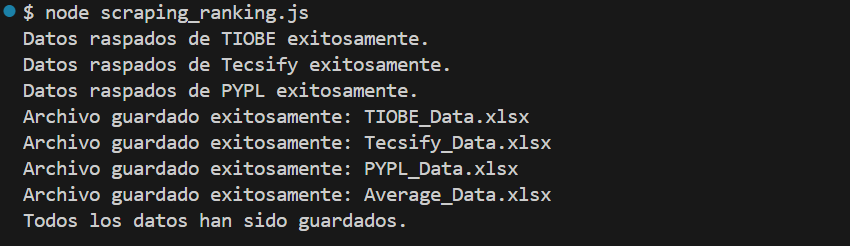

# **Trabajo Práctico: Web Scraping** - Ruth Gomez

Este proyecto implementa técnicas de web scraping utilizando **Node.js** para recopilar datos sobre la popularidad de los lenguajes de programación en 2024 a partir de tres fuentes clave: TIOBE, Tecsify y PYPL. La información extraída se organiza y se guarda en archivos Excel, lo que facilita el análisis y la comparación mediante gráficos generados manualmente.

## Descripción

El objetivo principal del proyecto es demostrar cómo utilizar técnicas de web scraping para extraer información valiosa de la web, procesarla y representarla gráficamente. Utilizamos bibliotecas y herramientas de JavaScript para obtener datos sobre la popularidad de diversos lenguajes de programación, específicamente aquellos más utilizados en el **desarrollo web**, y calcular promedios de popularidad a partir de diferentes fuentes.

## **Fuentes Utilizadas**
Se han elegido tres sitios web que publican rankings de lenguajes de programación:

1. **TIOBE** - [TIOBE Index](https://www.tiobe.com/tiobe-index/)
2. **Tecsify** - [Tecsify Blog](https://tecsify.com/blog/top-lenguajes-2024/)
3. **PYPL** - [PYPL Index](https://pypl.github.io/PYPL.html)

## Lenguajes de Programación Para el Desarrollo Web

La lista de lenguajes de programación que se consideran clave para el desarrollo web en este proyecto es la siguiente:

- **JavaScript**
- **Python**
- **Ruby**
- **PHP**
- **Java**
- **TypeScript**
- **HTML**
- **CSS**
- **Go**
- **C#**
- **Swift**

Estos lenguajes son los que se comparan en los distintos índices de popularidad utilizados en el scraping.

## Tecnologías Utilizadas

- **Node.js**: Entorno de ejecución para JavaScript en el servidor.
- **axios**: Biblioteca para realizar solicitudes HTTP y obtener el contenido de las páginas web.
- **cheerio**: Librería que permite analizar y manipular el contenido HTML, simulando el funcionamiento de jQuery.
- **puppeteer**: Herramienta para automatizar la navegación web y realizar scraping en sitios que requieren interacción con JavaScript.
- **excel4node**: Biblioteca para generar y manipular archivos de Excel, incluyendo gráficos y tablas.
- **XLSX**: Módulo utilizado para trabajar con archivos de Excel y exportar datos.

## Partes del Código
### Librerías Importadas
```javascript
const axios = require('axios'); //Solicitudes HTTP
const cheerio = require('cheerio'); //Manipular el Dom de las páginas web
const XLSX = require('xlsx'); //Manejar archivos Excel
const puppeteer = require('puppeteer'); //Automatizar el navegador
```
### Lista de Lenguajes de Programación para el Desarrollo Web
```javascript
const webLanguages = [
    "JavaScript",
    "Python",
    "Ruby",
    "PHP",
    "Java",
    "TypeScript",
    "HTML",
    "CSS",
    "Go",
    "C#",
    "Swift"
];
```
### Funciones de Scraping
- **Tiobe**
```javascript
async function scrapeTIOBE() {
    try {
        const response = await axios.get('https://www.tiobe.com/tiobe-index/');
        const $ = cheerio.load(response.data);
        
        const languages = [];
        $('#top20 tbody tr').each((index, element) => {
            const rank = $(element).find('td').eq(0).text().trim();
            const lang = $(element).find('td').eq(4).text().trim();
            const percentage = $(element).find('td').eq(5).text().trim().replace('%', '').replace(',', '.');
            
            if (webLanguages.includes(lang)) {
                languages.push({ Source: 'TIOBE', Language: lang, Rank: rank, Percentage: parseFloat(percentage) });
            }
        });

        console.log("Datos raspados de TIOBE exitosamente.");
        return languages;
    } catch (error) {
        console.error("Error al raspar datos de TIOBE:", error.message);
    }
}
/* Proceso:
Hace una solicitud HTTP a la página web de TIOBE.
Usa cheerio para analizar el contenido HTML y extraer los datos de interés (ranking, lenguaje y porcentaje de uso).
Filtra los lenguajes que están en webLanguages y los guarda en un array languages.*/
```
  
- **Tecsify**
```javascript
async function scrapeTecsify() {
    try {
        const response = await axios.get('https://tecsify.com/blog/top-lenguajes-2024/');
        const $ = cheerio.load(response.data);
        
        const languages = [];
        $('figure.wp-block-table table tbody tr').each((index, element) => {
            const rank = $(element).find('td').eq(0).text().trim();
            const lang = $(element).find('td').eq(4).text().trim();
            const percentage = $(element).find('td').eq(5).text().trim();
            
            if (webLanguages.includes(lang)) {
                languages.push({ Source: 'Tecsify', Language: lang, Rank: rank, Percentage: parseFloat(percentage.replace(',', '.')) });
            }
        });

        console.log("Datos raspados de Tecsify exitosamente.");
        return languages;
    } catch (error) {
        console.error("Error al raspar datos de Tecsify:", error.message);
    }
}
/*Proceso: Similar a scrapeTIOBE, pero analiza una estructura HTML diferente.*/
```
- **PYPL**
```javascript
async function scrapePYPL() {
    const browser = await puppeteer.launch();
    const page = await browser.newPage();

    // Navegar a la página
    await page.goto('https://pypl.github.io/PYPL.html', {
        waitUntil: 'networkidle2' // Espera a que la red esté inactiva
    });

    // Obtener el contenido de la tabla
    const languages = await page.evaluate(() => {
        const rows = Array.from(document.querySelectorAll('table tbody tr'));
        return rows.map(row => {
            const cells = row.querySelectorAll('td');
            if (cells.length > 0) {
                return {
                    Source: 'PYPL',
                    Language: cells[2]?.innerText.trim(),
                    Rank: cells[0]?.innerText.trim(),
                    Share: cells[3]?.innerText.trim().replace('%', '').replace(',', '.')
                };
            }
        })
        .filter(Boolean) // Filtrar filas vacías
        .filter(item => item.Language !== "© Pierre Carbonnelle, 2023"); // Filtrar filas irrelevantes
    });

    await browser.close();
    
    // Filtrar solo los datos desde Rank 1 hasta Rank 28 y que estén en webLanguages
    console.log("Datos raspados de PYPL exitosamente.");
    return languages.filter(item => 
        parseInt(item.Rank) >= 1 && parseInt(item.Rank) <= 28 &&
        webLanguages.includes(item.Language)
    );
}
/*Proceso:
Lanza un navegador Chromium con puppeteer y navega a la página de PYPL.
Usa page.evaluate para ejecutar un script en la página que extrae los datos.
Filtra los lenguajes que están en webLanguages y que tienen un ranking del 1 al 28.*/

```
### Función de Cálculo de Promedio Total de TIOBE, Tecsify y PYPL
```javascript
function calculateAverages(tiobeData, tecsifyData, pyplData) {
    const averages = [];
    const allLanguages = {};

    tiobeData.forEach(item => {
        allLanguages[item.Language] = {
            TIOBE: item.Percentage,
            Tecsify: null,
            PYPL: null,
            TIOBE_Rank: item.Rank,
        };
    });

    tecsifyData.forEach(item => {
        if (allLanguages[item.Language]) {
            allLanguages[item.Language].Tecsify = item.Percentage;
        } else {
            allLanguages[item.Language] = {
                TIOBE: null,
                Tecsify: item.Percentage,
                PYPL: null,
                TIOBE_Rank: null,
            };
        }
    });

    pyplData.forEach(item => {
        if (allLanguages[item.Language]) {
            allLanguages[item.Language].PYPL = parseFloat(item.Share);
        } else {
            allLanguages[item.Language] = {
                TIOBE: null,
                Tecsify: null,
                PYPL: parseFloat(item.Share),
                TIOBE_Rank: null,
            };
        }
    });

    for (const lang in allLanguages) {
        const tiobePercentage = allLanguages[lang].TIOBE;
        const tecsifyPercentage = allLanguages[lang].Tecsify;
        const pyplPercentage = allLanguages[lang].PYPL;

        let average = null;
        const percentages = [tiobePercentage, tecsifyPercentage, pyplPercentage].filter(p => p !== null);
        
        if (percentages.length > 0) {
            average = (percentages.reduce((sum, p) => sum + p, 0) / percentages.length).toFixed(2);
        }

        averages.push({
            Language: lang,
            TIOBE: tiobePercentage,
            Tecsify: tecsifyPercentage,
            PYPL: pyplPercentage,
            Average: average,
        });
    }

    return averages;
}
/*Proceso:
Crea un objeto allLanguages que consolida las estadísticas de cada lenguaje.
Calcula el promedio de las estadísticas disponibles y las almacena en averages.*/
```
### Función **Guardar Datos en Excel**
```javascript
function saveToExcel(fileName, data, sheetName) {
    if (!data || data.length === 0) {
        console.log(`No hay datos para guardar en ${fileName}`);
        return;
    }
    
    const wb = XLSX.utils.book_new();
    const sheet = XLSX.utils.json_to_sheet(data);

    XLSX.utils.book_append_sheet(wb, sheet, sheetName);
    XLSX.writeFile(wb, fileName);
    console.log(`Archivo guardado exitosamente: ${fileName}`);
}
```
### Función Principal
```javascript
async function main() {
    const tiobeData = await scrapeTIOBE();
    const tecsifyData = await scrapeTecsify();
    const pyplData = await scrapePYPL();

    saveToExcel('TIOBE_Data.xlsx', tiobeData, 'TIOBE');
    saveToExcel('Tecsify_Data.xlsx', tecsifyData, 'Tecsify');
    saveToExcel('PYPL_Data.xlsx', pyplData, 'PYPL');

    const averageData = calculateAverages(tiobeData, tecsifyData, pyplData);
    saveToExcel('Average_Data.xlsx', averageData, 'Promedio');

    console.log('Todos los datos han sido guardados.');
}

main().catch(console.error);
```
# Ejecución del Código


# **Capturas de Excel y Grafico en Power BI**
## Tablas Generadas en Excel
### Datos de TIOBE

### Datos de Tecsify

### Datos de PYPL

### Datos de Promedios Total de TIOBE, Tecsify y PYPL


## Grafico en Power BI


- **Nota o Aclaración**: Aunque los datos se generan automáticamente, el diseño de las tablas y los gráficos se aplicaron manualmente en Excel o en Power BI, debido a problemas de compatibilidad con las versiones de la biblioteca XLSX.
